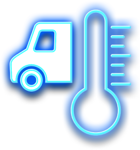
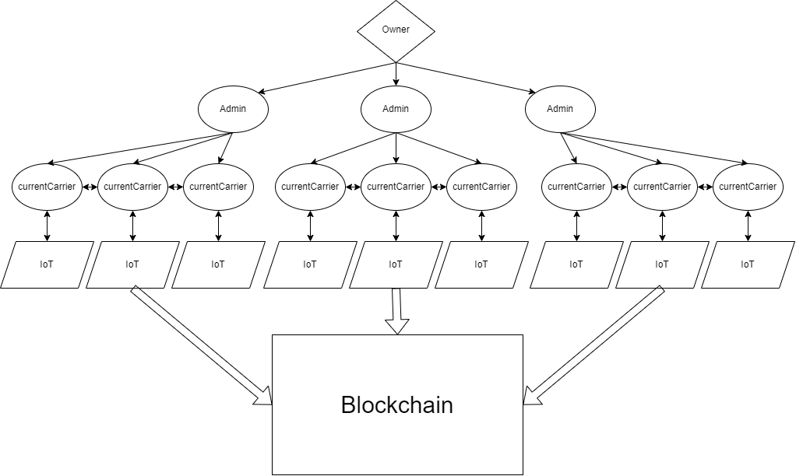

<div align="center">

</div>

<div align="center">


</div>
	
<h1>❄ Soğuk Tedarik Zinciri</h1>
<h3>Eczane/ilaç hırsızlığının, nakliye sırasında sıcaklık sapmalarının kaçınılmaz olduğu merkezi veritabanı sistemlerini çözmeye adanmış basit, şeffaf, fakat aynı zamanda verimli tamamen merkeziyetsiz soğuk tedarik zinciri.</h3>
</div>

## 📦 Kurulum

### Nodejs ve npm gereksinimleri
```shell
git clone https://github.com/medipolchain/supply-chain.git

cd supply-chain

npm i
```

### Python kütüphaneleri
```shell
pip install -r requirements.txt
```

## 📂 Klasör yapısı
```
+---Arduino-Web3
+---backend
|   +---src
|   |   +---config
|   |   +---contract
|   |   |   +---ABIs
|   |   +---db
|   |   +---middleware
|   |   +---models
|   |   +---routers
|   |   +---web3
+---client
|   +---components
|   |   +---hooks
|   |   +---providers
|   |   |   +---web3
|   |   |   |   +---hooks
|   |   +---ui
|   |   |   +---AdminContent
|   |   |   |   +---base
|   |   |   +---ConnectButton
|   |   |   |   +---base
|   |   |   +---Layout
|   |   |   +---MetamaskSVG
|   |   |   +---RestrictedArea
|   |   |   |   +---base
|   |   |   +---SettingsModal
|   |   |   |   +---base
|   +---pages
|   +---public
|   |   +---contracts
|   +---styles
|   +---utils
+---contracts
+---scripts
+---src
+---test
```

## 📍 Akış diyagramı


## 📝 Veritabanı yapısı
```js
address owner x
mapping(address => bool) public admins; x
mapping(bytes32 => Product) public products; x

struct Product {
	address _admin,
	address _currentCarrier,
	bool _deliveryDone
} x

event OwnerChanged x 
event AdminAdded x 
event AdminRemoved x
event PackageCarrierChange x
event NewPackageCreated x
event PackageArrived x
event DeletePackage x
event TemperatureViolated x
event SetPackageAdmin x
event SetPackageDeliveryDoneOrUndone x

function addAdmin x Owner
function removeAdmin x Owner
function transferOwnership x Owner
function createDeliveryPackage x Owner, Admin
function deleteDeliveryPackage x Owner, Admin
function changePackageCarrier x Owner, Admin, Current Carrier 
function packageArrived x Owner, Admin, Current Carrier
function temperatureViolate x Owner, Admin

function setPackageDeliveryDoneOrUndone x Owner, Admin
function setPackageAdmin x Owner
function getPackageDeliveryDone x 
function getPackageAdmin x
function getPackageCurrentCarrier x

modifier onlyOwner() x
modifier onlyAdminOrOwner() x
```

## 📸 Ekran görüntüleri
||||
| ------------- | ------------- | ------------- |
||||

## 🎥 Ekran kaydı
|Metamask Connection and Admin Panel Transition|Create Product Through Admin Panel|Mail Notification Subscription|Heat Sensor and Blockchain Transaction IoT|
| ------------- | ------------- | ------------- | ------------- |
|[](https://www.youtube.com/watch?v=YMg4wP34dS4)|[](https://www.youtube.com/watch?v=8KDqg36Ajqs)|[](https://www.youtube.com/watch?v=P_YzSvvrf5k)|[](https://www.youtube.com/watch?v=Sc31JmGvMy0)|

## 🤝 Takım üyeleri
[Berkay Ermiş - @berkayermis](https://github.com/berkayermis) - Frontend / IoT

[Mehmet Berat Öztürk - BeratOz01](https://github.com/BeratOz01) - Frontend / Backend

[Vusal Ismayilov - @woosal1337](https://github.com/woosal1337) - Solidity / IoT

[Furkan Boyraz - @hellomrbj](https://twitter.com/hellomrbj) - Blockchain / Security

## 📝 Lisans
[MIT](https://opensource.org/licenses/MIT): License
